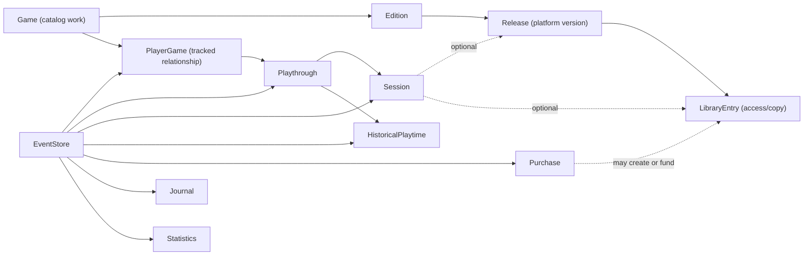
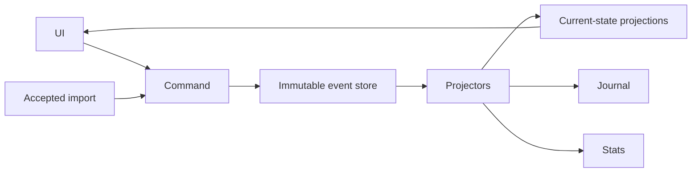

# Player history architecture design

Date: 2026-08-09
Related issue: https://github.com/KucharczykL/timetracker/issues/37

## Status and purpose

This design replaces the narrow plan to surface session notes directly from the
current models. The Player's Journal remains the user-facing goal, but the
existing models cannot represent a player's history without losing repeated,
approximate, imported, or corrected facts.

The design therefore establishes a durable player-history foundation first.
It deliberately separates the rich internal model from the ordinary user
experience: common actions stay simple, related changes are explicit, and
advanced historical detail appears only when requested.

The existing Player's Journal mockups remain the approved visual direction.
Where its earlier design document conflicts with this document—most notably
statuses, bundles, PlayEvents, and journal data sources—this document is
authoritative. The Journal document must be reconciled before Journal
implementation begins.

## Design principles

1. Never invent precision. Unknown dates, approximate dates, aggregate
   playtime, and cross-platform play are stored as the facts the player knows.
2. Never make related changes silently. A command may offer a checked-by-default
   companion change, but the user can see and decline it.
3. Keep the ordinary interface small. Every Game has a default playthrough, but
   a casual user need not name or manage it.
4. Preserve history. Corrections and soft deletions create events; they do not
   destroy the prior fact.
5. Keep catalog facts separate from player facts. IGDB metadata is not a player
   status, playthrough, copy, or purchase.
6. Build in small, reversible slices. New projections prove parity before old
   write paths or fields are removed.
7. Every deferred idea is either a named follow-up issue or explicitly out of
   scope. Nothing is left as an unspecified “later.”

## Domain overview

`PlayerGame` is the player's tracked relationship to a canonical `Game`. It
owns personal state such as status and mastered, even when the player does not
own a copy. `LibraryEntry` has the narrower meaning of a particular route of
access. This prevents IGDB catalog data, personal status, and ownership from
being combined in one row.

`PlayerGame` is logically scoped to the tracked library. The first migration
preserves timetracker's current site-wide shared library and does not silently
turn existing Django accounts into separate libraries. Multi-library tenancy is
not part of this redesign.

## Bounded event sourcing

Event sourcing applies to the player's library and playing history, not to the
entire application. IGDB/reference metadata, application settings, platform
definitions, exchange rates, and other replaceable catalog data remain ordinary
relational state.

### Write and read paths

- All player-history writes go through named commands.
- A command validates current state and emits one or more immutable events.
- Events and their synchronous projection updates commit in the same SQLite
  transaction. The design does not introduce eventual consistency.
- Normal pages and APIs query ordinary Django projection models. They do not
  replay events during requests.
- Projection models are not written directly by forms, APIs, admin, imports, or
  data repair scripts.
- Projections are rebuildable and tested against a replay from an empty state.
- A compound user action shares a correlation ID. This lets the Journal render
  one meaningful entry while Audit History exposes all underlying changes.

### Event envelope

Every event has stable, portable metadata independent of projection table IDs:

- event UUID;
- stream UUID and monotonically increasing stream sequence;
- event type and payload schema version;
- exact UTC `recorded_at` timestamp;
- effective temporal value, when the event describes a real-world time;
- actor, correlation ID, and causation ID;
- generic source metadata and idempotency key;
- versioned JSON payload.

Source metadata can distinguish manual entry, migration, native restore, and an
accepted external import without putting Steam- or Backloggd-specific columns
on every domain model. Event payloads are upcast when schemas evolve; historic
events are not rewritten for ordinary application changes.

The first proof of concept is intentionally narrow: create, correct, delete,
and restore Sessions; rebuild the current Session/playtime projections; and
rebuild one yearly statistics projection. It must prove transactionality,
idempotency, replay, and parity before more domains move onto the event store.

## Temporal facts

Every event distinguishes:

- `recorded_at`: exactly when timetracker received the fact;
- `effective_time`: when the player says the fact occurred.

Timed Sessions continue to use exact zoned timestamps. Imprecise calendar facts
use a practical subset of EDTF generated by the interface:

- day, month, year, and decade precision;
- approximate and uncertain qualifiers;
- closed/open date ranges;
- unknown date.

The canonical EDTF expression is preserved. Query projections also store parsed
lower/upper bounds, precision, and qualifiers so ordinary queries do not parse
strings repeatedly. The initial subset excludes seasons, sets, extended years,
and raw user-authored EDTF.

Forms show a normal date field by default. “I don't know the exact date” expands
inline to Month, Year, Decade, Range, and Unknown, with optional Approximate and
Uncertain controls. The application generates EDTF behind the scenes.

For a known day without a known clock time, an optional categorical `day_part`
may be Morning, Afternoon, Evening, Night, or Unknown. It is never converted to
a fabricated hour. It controls display and within-day ordering only and is not
available for month-, year-, or decade-precision facts.

Statistics respect the recorded precision. A decade fact may contribute to a
decade or all-time total, but never to an invented year, month, day, or streak.

## Catalog identity

### Game, Edition, and Release

- `Game` is one materially distinct playable work and is platform-independent.
- A remake or substantial remaster is a separate Game related to the original.
- DLC and expansions are Games with an explicit kind and parent Game.
- `Edition` represents Standard, Deluxe, Collector's, and comparable editions
  of one Game.
- `Release` represents an Edition made available on a platform.

This shape aligns with a future IGDB integration without making IGDB the local
source of truth. External identities use a provider-neutral reference model,
not a single IGDB-specific field.

### Migration safety

Every current platform-specific Game becomes a provisional canonical Game with
a default Edition and a Release on its existing platform. Rows are never merged
automatically by matching name. A later IGDB/manual reconciliation feature may
suggest that two provisional Games are ports of one work, but the player must
approve every merge. Remakes and remasters remain separate related Games.

Only DLC already added to the player's library is shown beneath its parent by
default. Discovery of unowned catalog DLC is separate from the library view.
DLC remains searchable and can be shown as a top-level item through filtering.

Current catalog fields remain lossless: `name`, `sort_name`, release years, and
Wikidata identity move to the appropriate Game/Edition/Release or external
reference. A current NULL platform creates an explicitly unspecified
provisional Release rather than inventing a platform.

## PlayerGame, status, and playthroughs

### Simple current status

`PlayerGame` has one user-facing current status:

- Unplayed — never meaningfully started;
- Played — played, with nothing stronger asserted;
- Completed — main objective completed;
- Retired — finished with an endless or no-ending Game;
- Shelved — unfinished and may be resumed;
- Abandoned — unfinished with no intention to return.

The current `Finished` label becomes `Completed`. `mastered` remains a separate,
stronger fact. Replaying a completed Game does not silently demote it from
Completed.

The model deliberately does not split status from priority or expose separate
Playing/Backlog/Wishlist toggles. Related changes are explicit:

- a first-playthrough form may offer checked “Also mark Game Played”;
- completing a playthrough may offer checked “Also mark Game Completed”;
- the compact status selector remains immediate, followed by an optional action
  such as “Record undated playthrough” or “Mark current playthrough completed.”

`PlayerGame` also has one advanced, explicitly user-controlled preference:
**Exclude from unfinished games**. It affects unfinished-game lists and
completion-backlog statistics only. It is not a status, is never inferred from
genre or catalog metadata, and does not change automatically when status or
playthrough facts change. Existing `Purchase.infinite=True` values migrate to
this preference for every affected Game, preserving their current statistical
meaning while moving the field off the unrelated Purchase model.

### Mandatory, quiet playthroughs

Every PlayerGame automatically has `Playthrough 1`. Its name is optional; a
blank name displays `Playthrough N`. Every Session belongs to exactly one
Playthrough.

A Playthrough contains factual lifecycle information only:

- it has or has not started, with an optional effective date;
- it has or has not completed the main objective, with an optional effective
  date.

It has no Abandoned, Shelved, priority, or outcome status. An incomplete
playthrough can belong to a PlayerGame currently marked Shelved or Abandoned.
A Session proves that a playthrough started, but does not prove the Session was
the exact start date.

“Played before” is an explicit Game action, and may also appear on Add Game. It
marks the default playthrough started with an unknown date and requires no
Session or duration. This supports sparse history and future reviews.

A playthrough follows one save/journey, not one platform. It may use multiple
Releases and LibraryEntries for cross-save. When a platform change is detected,
the interface offers continuing the current playthrough or starting another;
it never silently decides. Each Session can retain both the Release/copy used
and the physical Device used.

### Existing Session reconciliation

Each existing PlayEvent becomes a Playthrough. A legacy Session is assigned
automatically only when its date belongs unambiguously to one PlayEvent's exact
date interval. Ambiguous Sessions are preserved in a system-created **Imported
history—needs sorting** playthrough rather than assigned to a guessed journey.
The migration reports how many Sessions require review.

The mandatory-playthrough migration includes a proper **Organize sessions** UI;
it is not deferred to Library Health. From a Game's Playthrough section, the
player can:

- filter and group Sessions by current Playthrough, date, and Device;
- select one, many, a date range, or all visible Sessions;
- move the selection to an existing Playthrough;
- create a new Playthrough as the move target;
- inspect the Session date, duration, Device, and note before moving it;
- finish cleanup and archive the empty imported-history bucket.

The interaction uses selection plus a bulk action rather than requiring drag
and drop. It works as a stacked selectable list on mobile. A bulk move issues
correlated `SessionPlaythroughChanged` events, so Audit History can show one
human action while retaining each Session's correction. Moving a Session does
not change its time, duration, Device, note, or Game and does not appear as new
play activity in the Player's Journal.

The current `PlayEvent` becomes playthrough start/completion history. The
current `GameStatusChange` becomes projected event history rather than a second
independent source of truth.

## Sessions and playtime

### Session timing modes

The current additive `duration_manual + duration_calculated` model is replaced
by explicit provenance:

1. **Timed Session** — exact start and optional end while running; duration is
   elapsed wall-clock time.
2. **Duration-only Session** — known calendar date plus entered duration; no
   invented start time.
3. **Corrected timed Session** — an explicit final-duration override replaces
   elapsed time; it is not added to it.

Duration provenance is Measured, Manually entered, or Corrected. Small AFK
periods may intentionally remain part of one timed Session. Pause/resume
segments are not introduced.

### Historical Playtime Record

Historical or aggregate playtime is not represented as fake Sessions. A
Historical Playtime Record contains:

- a duration;
- provenance such as Estimated, Externally measured, or Manually entered;
- an effective temporal value;
- one or more Playthroughs;
- an optional note and source reference.

If a player records “two playthroughs in the 2000s, about 100 hours total,” the
system creates two playthroughs and one record linked collectively to both. It
does not invent 50 hours per playthrough.

Totals visibly retain provenance, for example `242h total — 142h tracked ·
~100h estimated`. Historical records may contribute only at temporal
granularities justified by their effective time. They never contribute to
Session count, average/longest Session, streaks, device-per-day charts, or
invented calendar sessions.

An external cumulative counter such as Steam playtime is first stored as an
observation, not an additive duration. Import review can reconcile it against
already represented Sessions and previous observations, then explicitly create
an externally measured Historical Playtime Record for the untracked remainder.
Repeated synchronization therefore cannot add the same cumulative total twice.

## Access, ownership, purchases, and add-ons

### LibraryEntry

A `LibraryEntry` is one route of access to one Release. Multiple entries for the
same Release are supported, including owning both physical and digital copies.
It records independently meaningful axes:

- access: Owned, Borrowed, Rented, Subscription, Trial, Demo, or Pirated;
- format: Physical, Digital, or Unknown;
- acquired date and optional access-ended date.

“Formerly owned” derives from ended access. Wishlist and Played It are not
ownership values. Collector-grade physical condition is not modeled.

### Purchase

A Purchase is one financial transaction for one item. It may be linked to the
LibraryEntry it created, but a LibraryEntry may exist without a known Purchase.
Price, currency, refund, and transaction dates belong here rather than on
access or catalog identity.

Multi-game bundles are removed. Existing bundles migrate into one Purchase per
game with the price divided evenly as an editable starting point. Refund never
changes Game status; at most it ends the associated access.

DLC and expansion purchases point to the DLC/expansion Game or Release, not to
the base Game. Non-playable season passes, battle passes, and upgrades remain
Purchase product kinds associated with the base Game; an upgrade may also
reference the upgraded LibraryEntry. The current generic `related_game` field
is removed after migration.

Migration also preserves Purchase display name, acquisition/refund dates,
original and converted currency values, conversion-refresh state, ownership
and product kinds, platform, creation/update timestamps, and every game link.
Generated per-game prices and counts are recalculated from the migrated rows
rather than copied as independent facts.

Session migration preserves its note, Device, emulation flag, exact endpoint
timezones, timestamps, manual/calculated duration evidence, and creation/change
timestamps. Generated duration fields are recalculated under the new explicit
timing mode. An ended legacy Session with both elapsed and manual time becomes
a Corrected Session whose final duration equals the old total; the migration
event also retains the old elapsed/manual components as legacy evidence. A
manual-only Session becomes Duration-only, and an elapsed-only Session remains
Timed. A running legacy Session carrying a manual addition stays on the
compatibility write path until it is finished or explicitly corrected; it is
not silently converted while active. PlayEvent dates/notes and every status
transition—including undated transitions—are preserved as migration-sourced
history; generated days-to-finish is derived from migrated playthrough facts.

Saved filters and links whose field names or enum values change require an
explicit compatibility migration or a visibly invalid preset. They must not be
silently reinterpreted as different criteria.

## Soft deletion and archival

Deletion is domain-specific rather than one generic switch:

- Session deletion/restoration changes its projection visibility and statistics
  through `SessionDeleted` and `SessionRestored` events.
- A Game with history is archived rather than physically removed.
- A removed Purchase is voided/removed while preserving financial history.
- Imported/reference data may be hard-deleted only when unreferenced.
- Events are immutable and are never ordinarily deleted.

Normal queries exclude deleted projections. Uniqueness constraints and managers
must explicitly account for inactive rows. Audit History remains capable of
showing prior user-authored text after ordinary deletion; permanent event-text
redaction is not supported.

## Audit History and Player's Journal

Audit History and the Journal are two projections of the same events:

- **Audit History** is ordered by exact `recorded_at` and exposes commands,
  corrections, deletions, and underlying correlated events.
- **Player's Journal** is ordered by meaningful `effective_time` and collapses
  correlated implementation detail into a readable account of play.

The Journal retains the approved day-first, Game-second layout and responsive
mockups. It shows seven populated days per page by default and includes Sessions
and notes, playthrough starts/completions and their notes/days-to-finish,
Game-status changes, and optionally Purchases. Days containing only status
changes still appear.

A correlated PlaythroughStarted + status change to Played renders one Played
fact. A correlated PlaythroughCompleted + status change to Completed renders
one Completed fact. Uncorrelated facts remain separate; same-day timing alone
never proves they are the same action.

Session and playthrough notes share the approved preview budget. `See all N
notes` remains and opens the complete Game Journal at the relevant day. The
Journal is a projection/query surface, never another writable source of truth.

## Statistics

Existing statistics initially read current projections, not the event store.
Frequently used or difficult statistics may move incrementally into rebuildable
statistics projections after the Session proof of concept.

Projectors apply corrections symmetrically: replacing or deleting a fact
subtracts its old contribution before adding the new one. Replay parity tests
compare rebuilt totals against current projections. Not every statistic must be
materialized.

Exact, manual, corrected, externally measured, and estimated durations remain
distinguishable. The UI may combine justified contributions into a total but
must always make estimated duration visible and must not allocate imprecise time
to unsupported periods.

## Import and export foundation

The foundation supports portable data without exposing SQL dumps:

- stable UUIDs for events and exported domain identities;
- versioned event and catalog schemas;
- provider-neutral external references;
- generic source metadata and idempotency keys;
- rebuildable projections and a machine-level round-trip test.

A native backup will eventually package a manifest, ordered events, non-evented
catalog/reference state, settings, and checksums. Restore initially targets an
empty library and rebuilds projections transactionally.

Third-party import is non-interactive at ingestion. An uploaded file or service
snapshot creates an `ImportBatch` staging area without changing the live
library or statistics. An Import Inbox later presents proposed create, merge,
skip, and discard decisions, including safe batch actions. Only accepted staged
records issue normal commands and events.

Steam is an explicit import source. Initial Steam support is manual/repeatable
sync through the Import Inbox; scheduled sync is separate. Steam ownership maps
to LibraryEntries, identifiers map to external references, and cumulative
playtime uses the observation/reconciliation process described above.

The foundational work does not implement archive downloads, parsers,
ImportBatch models, matching, or Import Inbox UI.

## Migration and delivery strategy

The architecture is delivered as small additive slices, not one replacement
migration or one giant pull request:

1. Establish the event envelope, command boundary, and Session-only proof of
   concept.
2. Prove Session current-state, playtime, delete/restore, yearly-statistics, and
   empty-replay parity.
3. Add temporal-value and Historical Playtime primitives.
4. Introduce canonical catalog identity and external references without merging
   existing Games.
5. Introduce PlayerGame and mandatory default Playthroughs, then migrate
   PlayEvents/status history.
6. Introduce LibraryEntry and one-item Purchases, then migrate bundles and
   add-ons.
7. Move remaining player-history writes to commands/events in bounded groups.
8. Reconcile the Player's Journal spec and implement its projection/query layer
   and approved responsive UI.
9. Remove superseded fields and compatibility write paths only after parity
   checks are green.

The implementation plan must divide each numbered step further into issues that
produce one independently testable outcome. Schema additions, backfills, parity
checks, read-path switches, and old-field removal are separate work where doing
so reduces rollback risk.

## Required follow-up issues

These features are out of the current implementation scope but must be filed as
named issues rather than left floating:

1. **Named session checkpoints** — required short name, optional note, and the
   elapsed point within a running Session.
2. **Playthrough ratings and reviews** — at most one current review/rating per
   Playthrough, with edits retained through events and play-history context on
   presentation.
3. **Library Health diagnostics** — surface inconsistent facts and offer
   explicit repairs without silent status changes.
4. **Catalog discovery and IGDB reconciliation** — imported metadata, unowned
   DLC discovery, port merge suggestions, and remake/remaster relationships.
5. **Trash and recovery UI** — unified discovery and restoration of supported
   soft-deleted records.
6. **Versioned full-library backup and restore** — user-facing native archive,
   validation, empty-library restore, and transactional replay.
7. **Staged interoperable import/export with Import Inbox** — documented JSON
   and CSV, adapters, staging, matching, review, and accepted-event creation.
8. **Steam library importer and manual sync** — ownership, external identity,
   aggregate-playtime reconciliation, and repeat-safe manual synchronization.
9. **Scheduled Steam synchronization** — automation built on the proven manual
   sync path.

## Explicit non-goals

The design intentionally does not include:

- separate status and priority systems;
- inferred “endless Game” behavior or an Endless status;
- automatic Game merges or silent status changes;
- multi-game Purchase bundles or speculative order grouping;
- collector-grade physical condition;
- pause/resume Session segments;
- fabricated Sessions or distributed guessed hours;
- raw EDTF entry;
- permanent event-text redaction;
- event-sourcing IGDB/reference metadata, settings, or exchange rates.

## Design verification requirements

Before implementation planning, review this document against the existing
models and Player's Journal mockups for:

1. a lossless migration path for every current Game, Purchase, Session,
   PlayEvent, and GameStatusChange field;
2. stable command/event boundaries and synchronous transaction behavior;
3. replay parity for current state, playtime, soft deletion, and one statistic;
4. no fabricated temporal precision or double-counted aggregate time;
5. explicit user control over compound status/playthrough changes;
6. small, dependency-ordered issue boundaries;
7. every deferred feature appearing in the follow-up register.
