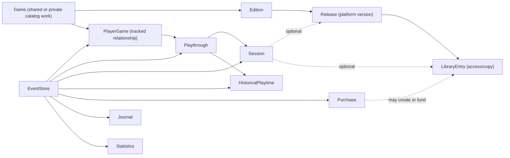
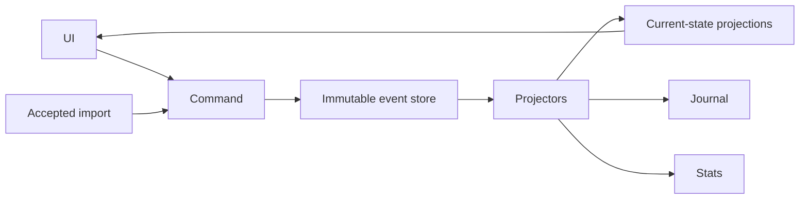

# Timetracker overhaul: event-centric player history and IGDB-backed catalog

Date: 2026-08-09
Related issue: https://github.com/KucharczykL/timetracker/issues/37

## Status and purpose

This design is the long-term overhaul of timetracker's player-history, catalog,
ownership, statistics, and list interaction architecture. It grew from the
narrow plan to surface Session notes because the existing models cannot
represent a player's history without losing repeated, approximate, imported,
corrected, or library-owned facts. The Player's Journal remains a major
user-facing outcome, not the boundary of the overhaul.

The design therefore establishes a durable player-history foundation first.
It deliberately separates the rich internal model from the ordinary user
experience: common actions stay simple, related changes are explicit, and
advanced historical detail appears only when requested.

The existing Player's Journal mockups remain the approved visual direction. Its
design document has been reconciled with this foundation for statuses,
Playthroughs, Purchases, temporal precision, and projected Journal data. The
overhaul remains authoritative for future domain changes.

## Design principles

1. Never invent precision. Unknown dates, approximate dates, aggregate
   playtime, and cross-platform play are stored as the facts the player knows.
2. Never make related changes silently. A command may offer a checked-by-default
   companion change, but the user can see and decline it.
3. Keep the ordinary interface small. Every Game has a default playthrough, but
   a casual user need not name or manage it.
4. Preserve history. Corrections and soft deletions create events; they do not
   destroy the prior fact.
5. Keep catalog facts separate from player facts. IGDB metadata is not a player
   status, playthrough, copy, or purchase.
6. Build in small, reversible slices. New projections prove parity before old
   write paths or fields are removed.
7. Every deferred idea is either a named follow-up issue or explicitly out of
   scope. Nothing is left as an unspecified “later.”
8. Player data is private by construction. Shared catalog identity never makes
   statuses, Sessions, notes, purchases, or history visible across users.
9. PostgreSQL is the sole runtime database. Existing SQLite libraries receive
   an explicit, verified, non-destructive migration path before the overhaul
   changes their domain representation.

This is a deliberate product and operating-model choice, not a technical claim
that a personal event stream is impossible on SQLite. Timetracker is intended
to support both personal self-hosting and later hosted multi-user operation
without maintaining two database implementations. PostgreSQL gives both paths
the same row-locking, constraint, timeout, JSON/index, backup, and operational
behavior. Paying the migration cost once, before the domain overhaul, is less
risky than porting the redesigned event/projection system later or carrying a
permanent backend compatibility matrix.

## Domain overview



`PlayerGame` is the player's tracked relationship to a canonical `Game`. It
owns personal state such as status and mastered, even when the player does not
own a copy. `LibraryEntry` has the narrower meaning of a particular route of
access. This prevents IGDB catalog data, personal status, and ownership from
being combined in one row.

Every PlayerGame and downstream player record has exactly one owning
`PlayerLibrary`. Catalog identity may be shared, but two libraries tracking the
same Game receive independent PlayerGames, statuses, Playthroughs, Sessions,
purchases, and statistics.

## PostgreSQL foundation

PostgreSQL migration is the foundation workstream and completes before user
ownership, event sourcing, catalog normalization, or other domain changes.
SQLite is not retained as a supported runtime backend.

### Runtime and development contract

- `DATABASE_URL` is the single runtime database configuration entry point,
  resolved through the existing configuration system.
- Production/self-host deployment ships an app-plus-PostgreSQL Compose path with
  separate persistent volumes and documented backup/restore operations.
- Local development and `make check` run against PostgreSQL 17 as well; CI and
  deployment images provision that major version explicitly. A PostgreSQL major
  upgrade is a separate tested operational change.
- The Makefile retains its one-command developer contract. `make init`,
  `make dev`, and `make check` depend on an `ensure-postgres` target that first
  uses an explicitly configured server, then a compatible PostgreSQL 17 local
  installation with the builtin locale provider, and otherwise provisions a
  pinned development distribution and disposable
  cluster in the project tool cache. Docker is supported but is not mandatory
  on Windows, macOS, or Linux. The target reports the server version and actual
  test connection before Django runs.
- pytest-django continues to isolate xdist workers. The PostgreSQL test harness
  creates/reuses one database per worker, caps workers against the configured
  connection budget, and reserves connections for each worker's live-server
  threads. CI runs the same topology at its lower worker count. The foundation
  issue records SQLite and PostgreSQL `make check` medians plus the worker count
  actually used for each run on the maintainer's machine; the PostgreSQL median
  must remain within 25% at the same worker count before cutover. A connection-
  limited lower worker count is reported separately rather than hidden inside
  that comparison.
- SQLite WAL, `IMMEDIATE` transaction mode, path-derived database settings, and
  SQLite-only date expressions are removed from runtime code.
- Event stream sequencing later uses PostgreSQL row locking and a unique
  stream/sequence constraint inside the same transaction as projections.
- PostgreSQL-specific capabilities may be used deliberately—JSONB/indexes,
  partial constraints, full-text catalog search—but domain behavior remains in
  tested application/projector code rather than opaque database triggers.
- Deployment initializes UTF-8 databases with PostgreSQL 17's platform-
  independent `builtin` locale provider and builtin locale `C.UTF-8`. Startup
  verifies the server major, encoding, provider, and locale; an operating-system
  libc locale with the same spelling is not considered compatible. Every
  nullable application sort states its NULL policy explicitly; list sorting
  uses NULLS LAST in both directions unless a field documents another rule.

### Current-schema portability

Before moving data, the current schema and application must run on PostgreSQL.
The portability issue includes these already-known corrections:

- `Session.duration_total` remains a generated compatibility column for this
  phase, but its expression repeats the elapsed-time expression instead of
  referencing generated `duration_calculated`, which PostgreSQL forbids;
- `Purchase.price_per_game` divides by `NULLIF(num_purchases, 0)`, so the row
  can be inserted before its M2M links update the count;
- `PlayEvent.days_to_finish` uses portable typed date subtraction plus the
  existing same-day-is-one rule, with cross-database fixtures proving parity;
- nullable sorts use explicit `OrderBy` NULL placement and deterministic
  tiebreakers, rather than inheriting opposite SQLite/PostgreSQL defaults; and
- the database collation is part of the deployment contract, not an operator
  default.

The work also audits every migration, remaining GeneratedField and RawSQL
expression, duration, timestamp/timezone, JSON field, conditional uniqueness
rule, case-insensitive query, sequence, and deletion behavior. Historical
migrations that cannot build a fresh PostgreSQL database are replaced by a
verified PostgreSQL-compatible squashed baseline; already-migrated SQLite
databases are unaffected because they are read only by the transfer tool.

Regex filtering is explicitly migrated rather than silently changing dialect.
SQLite evaluates Django `__regex` with Python syntax; PostgreSQL uses POSIX ARE.
The supported post-cutover regex language is a documented reject-by-default
portable subset: literals; escaped regex punctuation; `.`, `^`, and `$`;
ordinary bracket classes/ranges; grouping; alternation; and greedy `*`, `+`,
`?`, and bounded `{m,n}` quantifiers. It excludes shorthand/backslash character
classes and anchors, POSIX named classes, lookaround, backreferences, named or
conditional groups, inline flags, lazy/possessive quantifiers, and engine-
specific extensions. A whitelist parser—not successful compilation—decides
whether a saved pattern belongs to the subset; compiling it on PostgreSQL is a
secondary sanity check. Rejected patterns retain their JSON but are disabled
with a precise repair message. Existing length/complexity guards stay, their
SQLite-specific rationale is removed, and user-filter queries receive a bounded
transaction-local PostgreSQL `statement_timeout`. Timeout is reported as an
invalid/too-expensive filter rather than a generic server failure.

### One-time SQLite transfer

Existing data moves through an explicit temporary command, for example:

```text
make migrate-sqlite-to-postgres \
  SQLITE_PATH=/data/db.sqlite3 \
  DATABASE_URL=postgresql://...
```

The transfer:

- requires an empty migrated PostgreSQL target;
- requires the read-only source's `django_migrations` state to equal the pinned
  final SQLite bridge release; older installations must first upgrade to that
  release, run its SQLite migrations, verify it, and then perform the PostgreSQL
  transfer as a documented two-hop upgrade;
- opens the SQLite source read-only and never deletes or edits it;
- copies auth/users, settings, Games, Platforms, Devices, Sessions, Purchases,
  M2M links, PlayEvents, status changes, filters, and sequence state in foreign-
  key-safe order;
- omits/recalculates database-generated values where appropriate;
- runs transactionally on PostgreSQL and rolls back the target on failure;
- verifies row/link counts, foreign keys, duration/playtime totals, prices,
  timestamps/timezones, notes, statuses, and representative statistics;
- emits a machine-readable and human-readable reconciliation report;
- supports a dry run and refuses to merge into a non-empty target.

This transfer preserves the current integer identities only long enough to copy
the existing schema faithfully. The later UUID cutover creates and verifies a
temporary old-ID-to-UUID mapping while rewriting every foreign key and M2M
reference. Once that migration commits, the integer IDs and temporary mapping
are removed. There are no legacy integer URLs, redirects, or permanent alias
tables after cutover.

The two cutovers remain separate deliberately. PostgreSQL portability changes
expressions and runtime behavior while preserving every identity; UUID cutover
changes every identity/reference while running on the already-proven database.
Combining them would make a reconciliation mismatch unable to distinguish a
database-semantic defect from an identity-map defect and would couple their
rollback points. The extra verified pass is accepted for auditability.

The source file remains the rollback artifact until the operator explicitly
archives it. Automatic startup transfer is prohibited. After the supported
upgrade window, an explicit compatibility-cleanup issue removes the transfer
command and SQLite compatibility dependencies. Documented `pg_dump`/`pg_restore`
backups are the portable format until the deferred native archive feature ships;
native archives replace that user-facing role later rather than being a
prerequisite hidden in the cleanup phase.

## Bounded event sourcing

Event sourcing is the chosen production architecture for the player's mutable
library and playing history, not a pilot or optional direction. It does not
apply to the entire application: IGDB/reference metadata, application settings,
shared platform definitions, exchange rates, and other replaceable catalog data
remain ordinary relational state.

The committed event-sourced boundary includes PlayerGame status/mastered/
completion preference, Playthrough lifecycle, Sessions and notes, Historical
Playtime, LibraryEntry access lifecycle, Purchases/refunds, and future
reviews/ratings/checkpoints. Account presentation preferences, library
preferences, FilterPresets, custom catalog records, Devices, ImportBatch
staging, IGDB caches, and currency conversion rates remain conventional
relational data under their appropriate User, PlayerLibrary, or site boundary.
Derived conversion values may refresh without pretending the player made
another purchase.

### Write and read paths



- All player-history writes go through named commands.
- A command validates current state and emits one or more immutable events.
- Events and their synchronous projection updates commit in the same PostgreSQL
  transaction. The design does not introduce eventual consistency.
- Normal pages and APIs query ordinary Django projection models. They do not
  replay events during requests.
- Event-sourced projection models are not written directly by forms, APIs,
  admin, imports, background jobs, or data repair scripts. Replaceable
  conventional read models, such as currency valuations, have their own named
  writers and are not presented as player-authored history.
- Projections are rebuildable and tested against a replay from an empty state.
- A compound user action shares a correlation ID. This lets the Journal render
  one meaningful entry while Audit History exposes all underlying changes.

Each PlayerLibrary owns exactly one append stream with a stable stream UUID and
one lockable head row containing its current sequence. Events identify their
domain aggregate separately in the payload/envelope; a Session is not a second
stream. A command starts a transaction and locks the library head before reading
mutable projections or validating an optional expected library sequence. It
then appends all events for the human action contiguously, advances the head,
and updates synchronous projections in that transaction. Compound and bulk
commands therefore never acquire multiple stream-head locks or need a cross-
stream lock order. Different libraries remain independently writable.

A unique `(stream_id, sequence)` constraint is the final guard. PostgreSQL
serialization failures, deadlocks involving non-stream rows, and sequence
constraint collisions are retried at most three times with bounded jitter; an
exhausted retry returns a visible conflict asking the user to retry instead of
discarding either write. Repeating a completed `(library, idempotency_key)`
returns the original command result and its assigned sequence range. Reusing a
key with different canonical command input is rejected. A complete or partial
library replay always follows stream sequence; `recorded_at` and UUIDv7 are
presentation/audit tiebreakers, never an alternative event order.

Projection rebuild writes to shadow tables while normal reads continue. Writes
for the affected library are paused only for final validation and the atomic
projection swap; a failed rebuild leaves the old projection active. Operator
output includes event count, elapsed time, unresolved references, and parity
results. At 100,000 representative events, a complete library rebuild should
finish within 60 seconds on the documented development machine, a Journal page
query within 200 ms server-side at p95, and an ordinary synchronous command
within 100 ms at p95 excluding network time. A phase may revise a number only
with a recorded benchmark and an explicit design review.

Every phase that attaches another synchronous projector family re-measures
ordinary and representative bulk commands against the 100 ms budget and records
the number of rows written. Passing the first slice does not permanently exempt
later write amplification. Bulk operations that cannot fit the transaction and
latency budgets are explicitly chunked under one correlation ID, with partial
progress and retry semantics defined by that command rather than by the stream.

### Event envelope

Every event has stable, portable metadata independent of projection table IDs:

- event UUIDv7;
- immutable owning-library UUID, separate from the actor who issued the command;
- the owning library's one-to-one stream UUIDv7 and monotonically increasing
  library-stream sequence;
- event type and payload schema version;
- exact UTC `recorded_at` timestamp;
- effective temporal value, when the event describes a real-world time;
- actor, correlation ID, and causation ID;
- generic source metadata and idempotency key;
- versioned JSON payload.

Source metadata can distinguish manual entry, migration, native restore, and an
accepted external import without putting Steam- or Backloggd-specific columns
on every domain model. Event payloads are upcast when schemas evolve; historic
events are not rewritten for ordinary application changes.

### Durable references

Replay must not depend on a referenced conventional row still being editable or
deletable in its original form. Events carry the stable UUID of referenced
Devices and catalog records plus the small display snapshot needed to explain
the historical choice in Audit History. The snapshot is evidence, not a second
identity and not the source for current catalog presentation.

A Device or private catalog record referenced by an event is archived or
retained as a tombstone rather than physically deleted. Shared imported catalog
records use the same stale/tombstone rule while referenced. Hard deletion is
allowed only for unreferenced replaceable data or as part of whole-library
purge. Replay validates that every non-snapshotted reference can be resolved
before replacing live projections; a missing reference fails the rebuild with a
specific reconciliation report rather than silently nulling history.

PlayerGame status and Playthrough lifecycle are the first production evented
domain because Sessions require their final identities. Their cutover has its
own empty-replay, current-state parity, idempotency, and migration-correlation
gate. The following Session slice is the first domain with the complete create,
correct, delete, restore, aggregate-playtime, and yearly-statistics surface. It
proves the richer command/projector tooling and the budgets above before the
event boundary expands beyond PlayerGame, Playthrough, and Session.

If either gate misses a budget or reveals excessive implementation complexity,
the next phase must correct the event/projector tooling and issue boundaries
before expanding the boundary; it does not silently relax consistency or
maintain two write architectures. The overhaul is complete only when all
mutable player-history domains use commands, events, and projections.

## User ownership and isolation

The shared catalog/private library boundary is mandatory across every code
path.

### PlayerLibrary boundary

`PlayerLibrary` is the stable UUIDv7 identity that owns a player's domain data.
It has a one-to-one relationship with the Django `User`, but its identity does
not depend on the authentication model's primary-key type. The application has
no library chooser: creating a user creates exactly one library, and normal
requests resolve it automatically. This boundary lets a native backup restore or
transfer a library without rewriting immutable event ownership.

The Django `User` may retain its existing integer primary key. A User is an
actor who signs in and issues commands; a PlayerLibrary is the owner of the
resulting history. The User relationship is protected from ordinary cascade
deletion: account removal must first run the explicit library purge or detach
the library through an operator-controlled transfer. Shared and household
libraries are outside this overhaul.

A native restore into a User is allowed only while that User's automatically
created library is structurally empty. In one transaction, restore removes that
empty shell, creates the archived PlayerLibrary with its original UUID, attaches
it to the User, imports the required private/reference records, appends the
ordered events, and rebuilds projections. An existing occurrence of the archive
library UUID or any non-empty target causes the restore to fail; restore never
rewrites event ownership or merges libraries.

### Shared or site-scoped data

- public IGDB-backed Games, Editions, Releases, Platforms, companies, genres,
  images, and relationships;
- site IGDB credentials, cached source records, dump mirror, exchange rates,
  and operational settings.

### Player-library-owned data

- PlayerGames, statuses, mastered, and unfinished-list exclusions;
- Playthroughs, Sessions, notes, and Historical Playtime Records;
- LibraryEntries, Purchases, refunds, ratings, reviews, and checkpoints;
- events, projections, Audit History, statistics, imports, exports, and Trash;
- library preferences, saved filters, and Devices;
- custom catalog Games/Platforms that have no shared IGDB identity.

Presentation/account preferences such as theme, display time zone, date format,
and default landing page remain owned by the User. Library-behavior preferences
such as default Device, default currency, and Journal purchase visibility move
to a one-to-one `PlayerLibraryPreferences` record. This is conventional
library-owned data, not a fourth layer in the general USER/SITE/INFRA settings
registry. It replaces the current mixed `UserPreferences` row with two explicit
boundaries and lets a restored library carry its domain defaults without
overwriting the receiving account's presentation choices. Commands and forms
for these preferences are library-scoped directly; the existing registry keeps
its three scopes.

Every command accepts a PlayerLibrary context and rejects cross-library
references. Projection rows and relevant uniqueness constraints include the
library. Views, APIs, filters, actions, background jobs, exports, and statistics
start from the library boundary rather than filtering it as an afterthought. An
object belonging to another library is returned as not found, not disclosed
through a permission error. Automated coverage uses at least two users and
libraries for every new read/write surface and proves that counts, search
results, event streams, and related objects do not leak.

The event owner and actor are separate types: the owner is a PlayerLibrary and
the actor is normally its User. An explicit administrator-assisted repair may
act on behalf of a library while retaining who performed it. Staff status is
never an implicit bypass in normal library views.

Ordinary record deletion remains event-preserving. Account/library purge is a
separate destructive operation that removes the owning library's projections,
events, private catalog records, cached import files, and private text. It does
not delete shared catalog rows still used by other players. The owner-scoping
work includes the tested purge service and an operator command. Self-service
account deletion, recovery windows, and hosted account-lifecycle presentation
belong to the named hosted-operations follow-up.

### Transitional ownership migration

Legacy ownership support is temporary migration machinery, not permanent UI:

1. Create one UUIDv7 PlayerLibrary per User and add nullable library foreign keys
   while existing behavior remains compatible.
2. If player data exists and exactly one user/library exists, assign it
   automatically.
3. For an ambiguous installation, provide a temporary `make claim-library
   USER=<username>` command and equivalent `LEGACY_LIBRARY_OWNER` configuration
   for headless/container upgrades.
4. Verify that no player records remain unowned before event backfill/cutover.
5. Make ownership mandatory, then remove the command, configuration, nullable
   compatibility state, and temporary documentation in a later migration issue.

New installations create library-owned data from the first write and never see
this migration path.

## Temporal facts

Every event distinguishes:

- `recorded_at`: exactly when timetracker received the fact;
- `effective_time`: when the player says the fact occurred.

Timed Sessions continue to use exact zoned timestamps. Imprecise calendar facts
use a practical subset of EDTF generated by the interface:

- day, month, year, and decade precision;
- approximate and uncertain qualifiers;
- closed/open date ranges;
- unknown date.

The canonical EDTF expression is preserved. Query projections also store parsed
lower/upper bounds, precision, and qualifiers so ordinary queries do not parse
strings repeatedly. The initial subset excludes seasons, sets, extended years,
and raw user-authored EDTF.

Forms show a normal date field by default. “I don't know the exact date” expands
inline to Month, Year, Decade, Range, and Unknown, with optional Approximate and
Uncertain controls. The application generates EDTF behind the scenes.

For a known day without a known clock time, an optional categorical `day_part`
may be Morning, Afternoon, Evening, Night, or Unknown. It is never converted to
a fabricated hour. It controls display and within-day ordering only and is not
available for month-, year-, or decade-precision facts.

Every timeline query has a stable total order. Within a day, facts with exact
timestamps sort first by their local instant. Facts without a clock follow in
the ordered day-part buckets Morning, Afternoon, Evening, Night, then Unknown;
no fabricated clock boundary is needed to interleave the two precision levels.
Inside the same instant or bucket, `recorded_at` and finally event UUIDv7 are
ascending stable tiebreakers. Product-specific grouping may collect facts under
a Game, but it must preserve this order within each group. Pagination keys
include the same tiebreakers so facts cannot move or repeat between pages.

Statistics respect the recorded precision. A decade fact may contribute to a
decade or all-time total, but never to an invented year, month, day, or streak.

## Catalog identity

### Game, Edition, and Release

- `Game` is one materially distinct playable work and is platform-independent.
- A remake or substantial remaster is a separate Game related to the original.
- DLC and expansions are Games with an explicit kind and parent Game.
- `Edition` represents Standard, Deluxe, Collector's, and comparable editions
  of one Game.
- `Release` represents an Edition made available on a platform.

This shape aligns with the planned IGDB integration without making IGDB the
local source of truth. External identities use a provider-neutral reference
model, not a single IGDB-specific field.

### UUIDs, external references, and URLs

New domain, catalog, event, and stream records use UUIDv7 primary keys. A
current-state projection for one domain aggregate reuses that aggregate's UUID
rather than minting a new identity during replay; aggregate/statistics
projections may instead use an explicit natural compound key. UUIDv7 gives
exported objects stable portable identity while retaining rough creation
ordering and better index locality than fully random UUIDs. A UUID identifies a
record; it does not grant access, and every lookup still enforces the
PlayerLibrary boundary.

`ExternalReference` maps a provider, entity kind, and provider key to an
internal UUID. The entity kind is required because an IGDB ID may identify a
Game while a Steam App ID may identify a particular Release or store product.
The provider/kind/key tuple is unique. Wikidata and the former dedicated
external-ID fields migrate into the same model.

Canonical Game URLs combine the authoritative internal UUID with a readable
slug, for example `/tracker/game/<uuid>/clair-obscur-expedition-33/`. The slug is
derived from the current display name and is presentation only: it is never used
to choose the record and therefore needs no uniqueness rules. A UUID-only URL or
a URL carrying a stale/incorrect slug redirects to the current canonical form.
This keeps copied URLs understandable without creating permanent slug-alias
state when a title changes.

Provider helper URLs use an extensible form such as
`/tracker/game/igdb/<id>/` and redirect to the UUID-plus-slug canonical URL when
a local mapping exists. Equivalent Steam or Wikidata resolvers can be added
without changing the canonical identity. A GET resolver never silently imports
or creates a record: when the mapping is absent it returns a not-found/import
affordance that requires an explicit command. Integer IDs cease to be valid
application URLs at the UUID cutover.

### Migration safety

Every current platform-specific Game becomes a provisional canonical Game with
a default Edition and a Release on its existing platform. It is initially a
private catalog record owned by the legacy-library owner. Rows are never merged
automatically by matching name. IGDB/manual reconciliation may suggest that two
provisional Games are ports of one work, but the player must approve every
merge. Remakes and remasters remain separate related Games.

Only DLC already added to the player's library is shown beneath its parent by
default. Discovery of unowned catalog DLC is separate from the library view.
DLC remains searchable and can be shown as a top-level item through filtering.

Current catalog fields remain lossless: `name`, `sort_name`, release years, and
Wikidata identity move to the appropriate Game/Edition/Release or external
reference. A current NULL platform creates an explicitly unspecified
provisional Release rather than inventing a platform.

Legacy Platforms are classified without exposing arbitrary user-authored data.
The exact name/group pairs in the versioned built-in platform fixture become
shared site catalog records. Every unmatched existing Platform becomes private
to the claimed PlayerLibrary. Matching a private Platform to a future shared
IGDB Platform is an explicit reconciliation command, never a name-based
automatic merge.

### Shared and private catalog records

An IGDB-backed Game is shared catalog identity. Each player's relationship,
display preferences, status, and history remain on their private PlayerGame.
A custom Game with no shared identity is private to its creator by default, so
one player's typo, homebrew title, or personal naming convention never appears
in another player's catalog search.

When a private Game is matched to a shared IGDB Game, a command relinks its
current PlayerGame, Playthrough, Session, LibraryEntry, and Purchase projections
to the shared identity. Historic event payloads retain the original private Game
UUID. A permanent, cycle-free catalog-identity redirect resolves that UUID to
the shared Game during replay and imported-reference resolution; it remains for
as long as any event or external reference needs it. The redirect carries no
private player facts and cannot cross PlayerLibrary boundaries.

User presentation overrides are separate from the shared imported base. An
IGDB refresh never overwrites a user's custom sort/display name or other
explicit override. New Games added directly from IGDB begin with no overrides;
legacy/private values remain overrides until the user explicitly adopts the
imported value.

## IGDB-backed catalog

IGDB integration is an in-scope final workstream of the overhaul, even if it is
delivered after the event-sourced player domains and Journal. It is not a
deferred discovery issue.

### Deployment and authentication

- Every installation uses administrator-supplied Twitch application Client ID
  and Client Secret; credentials are site-level secrets resolved through the
  existing configuration system and are never exposed to browsers or users.
- A personal self-host and a hosted service use the same server-side client. In
  hosted mode the operator's credentials serve the shared catalog; players do
  not supply Twitch credentials.
- Tokens are cached and refreshed before expiry. Requests obey IGDB's current
  four-requests-per-second and eight-open-request limits through a PostgreSQL-
  coordinated site-wide limiter shared by web workers and Django-Q. The limiter
  leases expiring concurrency slots and schedules request starts under a locked
  rate state, so a crashed worker cannot hold capacity permanently; no process-
  local counter is treated as global. Rate-limit responses use bounded retry
  with jitter and become a visible temporary failure after the budget is
  exhausted.
- The integration remains disabled, with the manual/private catalog usable,
  when credentials are absent.
- Static visible IGDB attribution ships with the integration. A monetized
  hosted deployment requires an explicit partnership/terms review before
  launch.

### One ingestion pipeline, two source modes

Both source modes produce the same validated, schema-versioned IGDB source
record before normalization:

1. **On-demand mode (default):** server-side search and fetch; persist only
   selected Games and the related records needed by the local catalog. This is
   the default for personal self-hosting.
2. **Dump mirror mode (optional):** download selected endpoint CSV dumps,
   validate their advertised schema version, and build a locally indexed
   catalog. This is intended for hosted or larger installations. Before an
   operator enables it, the UI estimates required download, temporary, database,
   and index space from the dump manifests and refuses when configured free-space
   headroom would be violated. Raw archives are deleted after a successful
   atomic activation unless retention is explicitly enabled.

```text
IGDB API response ─┐
                   ├─> validated source record ─> normalized local catalog
IGDB CSV dump ─────┘
```

Dump ingestion is resumable and atomic per published dump version. A schema
change fails visibly before replacing the active mirror. Raw downloads live in
temporary/import storage and are recoverable without becoming application
truth. The site may switch source modes without changing catalog or player
identities.

### Normalization and refresh

The normalized subset is deliberately driven by product needs rather than a
mirror of every IGDB endpoint:

- Games, alternate names, summaries, types, and stable external identity;
- versions/editions through IGDB version relationships;
- Platforms, Releases, region-specific release dates, and their supplied date
  precision;
- DLC, expansions, ports, remakes, remasters, and parent relationships;
- involved companies, genres/themes needed by display and filtering;
- cover/image identity and locally cached presentation sizes;
- external-game identities, especially Steam and GOG storefront IDs.

IGDB source records retain external ID, checksum, source `updated_at`, payload
schema version, fetch time, and deletion/staleness state. Refresh updates the
imported base only. Local overrides and private player facts are never silently
changed. An IGDB deletion or relationship change marks the source record stale
and opens reconciliation; it never cascades into deletion of a tracked Game.

Partial IGDB release dates map into the same precision-aware temporal value
used elsewhere rather than being expanded into fake days. Images are cached
because IGDB documents that replaced images remain available only temporarily.
The cache is content-addressed, reports its size, and has a configurable default
2 GiB quota for personal installations. Unreferenced least-recently-used images
are evicted first; images referenced by tracked Games are retained unless the
operator explicitly runs a cache-prune command. Dump and image issues include
fixtures proving quota enforcement and recovery from interrupted cleanup.

### User workflows

1. Search IGDB from Add Game, with private manual creation always available.
2. Selecting a result imports the required catalog graph, creates the user's
   PlayerGame and default Playthrough, and offers the ordinary explicit status
   choices.
3. Existing private Games use a reconciliation inbox showing candidate,
   confidence evidence, field differences, editions/releases, and relationship
   effects. No match or merge is automatically committed.
4. Refresh presents conflicts only when an explicit local override or catalog
   relationship requires a decision; routine imported-base refresh is safe.
5. Unowned DLC/catalog discovery remains separate from the user's added-DLC
   library view.

Initial synchronization uses manual and scheduled refresh jobs over checksums,
source update timestamps, and dump versions. IGDB webhooks are explicitly out
of scope for the first integration because many self-hosted installations have
no stable public callback URL.

## PlayerGame, status, and playthroughs

### Simple current status

`PlayerGame` has one user-facing current status:

- Unplayed — never meaningfully started;
- Played — played, with nothing stronger asserted;
- Completed — main objective completed;
- Retired — finished with an endless or no-ending Game;
- Shelved — unfinished and may be resumed;
- Abandoned — unfinished with no intention to return.

The current `Finished` label becomes `Completed`. `mastered` remains a separate,
stronger fact. Replaying a completed Game does not silently demote it from
Completed.

The model deliberately does not split status from priority or expose separate
Playing/Backlog/Wishlist toggles. Related changes are explicit:

- a first-playthrough form may offer checked “Also mark Game Played”;
- completing a playthrough may offer checked “Also mark Game Completed”;
- the compact status selector remains immediate, followed by an optional action
  such as “Record undated playthrough” or “Mark current playthrough completed.”

Retired remains directly available in that immediate status selector for an
endless/no-ending Game. It is not inferred from stopping a Session, ending
access, or an uncompleted playthrough, and needs no artificial companion action.

`PlayerGame` also has one advanced, explicitly user-controlled preference:
**Exclude from unfinished games**. It affects unfinished-game lists and
completion-backlog statistics only. It is not a status, is never inferred from
genre or catalog metadata, and does not change automatically when status or
playthrough facts change.

The unrelated `Purchase.infinite` field remains authoritative until Purchase
migration. At that cutover, any Game linked to at least one
`Purchase.infinite=True` row receives **Exclude from unfinished games=True**;
the Purchase field, quick facet, saved presets, and purchase-based statistics
switch together, so there is no dual-write interval. This intentionally changes
mixed-purchase semantics: a Game with both infinite and normal purchases becomes
excluded at Game level. Preflight and the post-upgrade notice list every affected
mixed-purchase Game plus the old/new backlog counts for explicit review; the
change is not described as numerically identical preservation.

### Mandatory, quiet playthroughs

Every PlayerGame automatically has `Playthrough 1`. Its name is optional; a
blank name displays `Playthrough N`. Every Session belongs to exactly one
Playthrough.

A Playthrough contains factual lifecycle information only:

- it has or has not started, with an optional effective date;
- it has or has not completed the main objective, with an optional effective
  date.

It has no Abandoned, Shelved, priority, or outcome status. An incomplete
playthrough can belong to a PlayerGame currently marked Shelved or Abandoned.
A Session proves that a playthrough started, but does not prove the Session was
the exact start date.

“Played before” is an explicit Game action, and may also appear on Add Game. It
marks the default playthrough started with an unknown date and requires no
Session or duration. This supports sparse history and future reviews.

A playthrough follows one save/journey, not one platform. It may use multiple
Releases and LibraryEntries for cross-save. When a platform change is detected,
the interface offers continuing the current playthrough or starting another;
it never silently decides. Each Session can retain both the Release/copy used
and the physical Device used.

### Existing Session reconciliation

Existing PlayEvents become the numbered playthroughs for their Game, ordered
ascending by known start bound NULLS LAST, known completion bound NULLS LAST,
creation time, then legacy primary key. The earliest displays as `Playthrough
1`; migration does not create an additional empty default. A Game with no
PlayEvents receives the ordinary default `Playthrough 1`, and all its Sessions
belong to it.

For one or more PlayEvents, each known endpoint defines an open or closed
interval: missing start means no lower bound and missing completion means no
upper bound. A legacy Session is assigned automatically only when its effective
date—the recorded start date in its original timezone—belongs to exactly one
interval. This includes the sole PlayEvent when its
one interval contains the Session. A Session outside the only interval, inside
overlapping intervals, or matching none of several intervals is preserved in a
system-created **Imported history—needs sorting** playthrough rather than
assigned to a guessed journey. The imported-history bucket is a named system
bucket and does not consume a `Playthrough N` display number. Migration reports
zero-event defaults, automatic assignments, and every reason requiring review.

The mandatory-playthrough migration includes a proper **Organize sessions** UI;
it is not deferred to Library Health. From a Game's Playthrough section, the
player can:

- filter and group Sessions by current Playthrough, date, and Device;
- select one, many, a date range, or all visible Sessions;
- move the selection to an existing Playthrough;
- create a new Playthrough as the move target;
- inspect the Session date, duration, Device, and note before moving it;
- finish cleanup and archive the empty imported-history bucket.

The interaction uses selection plus a bulk action rather than requiring drag
and drop. It works as a stacked selectable list on mobile. A bulk move issues
correlated `SessionPlaythroughChanged` events, so Audit History can show one
human action while retaining each Session's correction. Moving a Session does
not change its time, duration, Device, note, or Game and does not appear as new
play activity in the Player's Journal.

### Selectable tables and bulk actions

Session organization is the first demanding consumer of shared selectable-table
infrastructure, not a bespoke selection implementation. `StyledTable` gains an
optional selectable personality used by Games, Sessions, Purchases, Devices,
Platforms, and later Playthroughs:

- the checkbox is integrated into the pinned identity cell, preserving that
  cell's `<th scope="row">` semantics and responsive behavior;
- a header checkbox selects the visible page, followed by an explicit “Select
  all N matching” action based on the active filter;
- a shared toolbar displays the selected count, clear action, and domain-owned
  mass actions;
- one selected row exposes single-record actions such as Edit; multiple rows
  expose only actions valid for the whole selection;
- action endpoints revalidate the resolved objects and record the exact IDs
  changed, including when selection began as “all matching”;
- destructive operations summarize their scope and require confirmation;
- on mobile the identity cell stacks the essential row summary beside its
  checkbox while lower-priority columns continue to drop;
- only the checkbox selects a row, because rows already contain links and
  direct field controls.

The current trailing Actions columns are retired. Their Edit/Delete and
domain-specific operations move into the shared selection toolbar. Meaningful
identity links and deliberately immediate field controls, such as the compact
Game-status selector, are not classified as Actions-column buttons and may
remain inline. Each bulk action declares its allowed selection cardinality and
is implemented separately from the selection framework.

The current `PlayEvent` becomes playthrough start/completion history. The
current `GameStatusChange` becomes projected event history rather than a second
independent source of truth.

## Sessions and playtime

### Session timing modes

The current additive `duration_manual + duration_calculated` model is replaced
by explicit provenance:

1. **Timed Session** — exact start and optional end while running; duration is
   elapsed wall-clock time.
2. **Duration-only Session** — known calendar date plus entered duration; no
   invented start time.
3. **Corrected timed Session** — an explicit final-duration override replaces
   elapsed time; it is not added to it.

Duration provenance is Measured, Manually entered, or Corrected. Small AFK
periods may intentionally remain part of one timed Session. Pause/resume
segments are not introduced.

### Historical Playtime Record

Historical or aggregate playtime is not represented as fake Sessions. A
Historical Playtime Record contains:

- a duration;
- provenance such as Estimated, Externally measured, or Manually entered;
- an effective temporal value;
- one or more Playthroughs belonging to the same PlayerGame;
- an optional single Release and optional single Device, each meaning the
  entire recorded duration is known to belong to that dimension;
- an optional note and source reference.

If a player records “two playthroughs in the 2000s, about 100 hours total,” the
system creates two playthroughs and one record linked collectively to both. It
does not invent 50 hours per playthrough.

A record never spans multiple Games. “About 200 hours across these three games”
must remain an import observation or be entered as separate player-known facts;
it cannot contribute to per-Game totals without an allocation the player did
not provide. Likewise, an absent or mixed Release/Device dimension contributes
to overall and per-Game totals but not to platform/device totals.

Totals visibly retain provenance, for example `242h total — 142h tracked ·
~100h estimated`. Historical records may contribute only at temporal
granularities justified by their effective time. They never contribute to
Session count, average/longest Session, streaks, device-per-day charts, or
invented calendar sessions.

An external cumulative counter such as Steam playtime is first stored as an
observation, not an additive duration. Import review can reconcile it against
already represented Sessions and previous observations, then explicitly create
an externally measured Historical Playtime Record for the untracked remainder.
Repeated synchronization therefore cannot add the same cumulative total twice.

## Access, ownership, purchases, and add-ons

### LibraryEntry

A `LibraryEntry` is one route of access to one Release. Multiple entries for the
same Release are supported, including owning both physical and digital copies.
It records independently meaningful axes:

- access: Owned, Borrowed, Rented, Subscription, Trial, Demo, or Pirated;
- format: Physical, Digital, or Unknown;
- acquired date and optional access-ended date.

“Formerly owned” derives from ended access. Wishlist and Played It are not
ownership values. Collector-grade physical condition is not modeled.

### Purchase

A Purchase is one financial transaction for one item. It may be linked to the
LibraryEntry it created, but a LibraryEntry may exist without a known Purchase.
Price, currency, refund, and transaction dates belong here rather than on
access or catalog identity.

Player-authored monetary facts use decimal amounts and ISO currency codes;
event JSON serializes decimal values as strings, never binary floating-point
numbers. Existing float values migrate through their stable decimal string
representation, with pre/post-migration totals checked in every currency.

Exchange-rate conversion is replaceable derived state, not a Purchase event.
`PurchaseValuation` stores the Purchase UUID, target currency, converted decimal
amount, rate identity/version, calculation time, and refresh state. The currency
task is the sole writer of this conventional model and never edits the
event-sourced Purchase projection. Statistics join the applicable valuation;
replay rebuilds Purchase facts first and recalculates valuations separately.
Exchange rates are also stored as decimals.

Multi-game bundles are removed. Existing bundles migrate into one Purchase per
game with the price divided as evenly as the target decimal scale permits. The
migration works in integer units of the target field's smallest stored decimal
unit: every Game receives the quotient and the remaining units go one each to
Games ordered by legacy primary key. Each legacy float is first converted
through its stable decimal string and quantized once to the documented target
field scale; reconciliation reports any quantization delta. Original price and
each seeded converted valuation are then split independently by the same rule,
so every quantized pre/post total remains exactly equal. This is an accepted
one-time simplification for
the existing bundles: their former grouping is not retained as provenance or as
a new domain concept. Refund never changes Game status; at most it ends the
associated access.

DLC and expansion purchases point to the DLC/expansion Game or Release, not to
the base Game. Non-playable season passes, battle passes, and upgrades remain
Purchase product kinds associated with the base Game; an upgrade may also
reference the upgraded LibraryEntry. The current generic `related_game` field
is removed after migration.

Migration preserves Purchase display name, acquisition/refund dates, original
amount/currency, ownership and product kinds, platform, creation/update
timestamps, and every game link. Existing converted values and refresh state
seed `PurchaseValuation` and are checked for parity before normal conversion
refresh may replace them. Generated per-game prices and counts are recalculated
from the migrated rows rather than copied as independent facts.

Session migration preserves its note, Device, emulation flag, exact endpoint
timezones, timestamps, manual/calculated duration evidence, and creation/change
timestamps. Generated duration fields are recalculated under the new explicit
timing mode. An ended legacy Session with both elapsed and manual time becomes
a Corrected Session whose final duration equals the old total; the migration
event also retains the old elapsed/manual components as legacy evidence. A
manual-only Session becomes Duration-only, and an elapsed-only Session remains
Timed. A row with equal start/end timestamps and non-zero manual duration also
becomes Duration-only: its effective day comes from `timestamp_start` in the
recorded start timezone, while both original timestamps remain migration
evidence. A negative elapsed interval blocks cutover for explicit repair rather
than being classified. Before Session cutover, a preflight reports every running
legacy Session
with a non-zero manual addition and blocks the cutover. The player must either
finish it, explicitly correct it to a final duration, or remove the manual
addition and retain it as a running Timed Session. No indefinite compatibility
write path remains after cutover. PlayEvent dates/notes and every status
transition—including undated transitions—are preserved as migration-sourced
history; generated days-to-finish is derived from migrated playthrough facts.

A non-null legacy `GameStatusChange.timestamp` is the effective transition
time, not merely a migration recording time: live signals wrote the moment of
the player's action, while the original data migration deliberately used the
earliest Session, refund/drop date, or PlayEvent completion date. It therefore
enters the daily Journal using the library owner's configured display timezone.
A null status timestamp
remains unknown and enters only the Game Journal's Approximate history.
PlayEvent `started` and `ended` are day-precision effective values; a missing
endpoint stays unknown.

Legacy PlayEvent lifecycle facts and legacy status facts receive one migration
correlation ID only when an unambiguous pair exists: same Game, compatible
started/Played or ended/Completed meaning, and the same effective local day.
Exactly one fact on each side is required. Ambiguous or unmatched facts retain
separate correlation IDs and render separately; migration never collapses them
by a broader “probably the same action” guess. The reconciliation report lists
the paired, ambiguous, and unmatched counts.

Saved FilterPresets carry a schema version and pass through a deterministic
migration registry. Supported fields and enum values are rewritten explicitly.
An unrepresentable preset retains its original JSON, is disabled, and displays
the exact unsupported criterion plus Edit/Delete actions; it is never silently
reinterpreted or discarded. Ephemeral bookmarked query URLs receive no
compatibility promise after the documented cutovers.

## Filters and list contracts

Every domain-field change is also a filter-system change. The owning issue must
update together:

- the typed criterion and `to_q()` mapping;
- the corresponding Game/Session/Purchase/PlayEvent filter dataclass;
- `QUICK_FACETS` and quick-editability/degrade behavior;
- advanced filter field metadata;
- the TypeScript filter-tree serializer and fixtures;
- the Python/TypeScript semantic contract tests; and
- the versioned FilterPreset migration described above.

Precision-aware temporal filters use interval-overlap semantics without
pretending an approximate fact occurred on a particular day. A fact matches a
range when its stored possible lower/upper bounds overlap that range. The UI
labels this operator **could overlap**. Exact **occurred between** remains
available only for day- or timestamp-precision facts wholly contained in the
range. Precision and approximate/uncertain qualifiers are independently
filterable. For example, “2000s, approximate” can match `could overlap
2000-01-01…2009-12-31`, but it cannot match an exact calendar-day criterion or
contribute to a day-scoped count.

## Soft deletion and archival

Deletion is domain-specific rather than one generic switch:

- Session deletion/restoration changes its projection visibility and statistics
  through `SessionDeleted` and `SessionRestored` events.
- A player's tracked Game is hidden through `PlayerGameArchived` and restored
  through `PlayerGameRestored`; one library never archives a shared Game for
  another library.
- A referenced private catalog Game is retained as an archived record or merge
  tombstone. An unreferenced private Game may be physically deleted; shared
  imported Games use site-level stale/tombstone handling.
- A removed Purchase is voided/removed while preserving financial history.
- Imported/reference data may be hard-deleted only when unreferenced.
- Events are immutable and are never ordinarily deleted.

Normal queries exclude deleted projections. Uniqueness constraints and managers
must explicitly account for inactive rows. Audit History remains capable of
showing prior user-authored text after ordinary deletion; permanent event-text
redaction is not supported.

Until the unified Trash UI follow-up ships, each event-sourced delete response
offers an immediate **Undo** action and an authenticated operator command can
list and restore deleted records by library, type, and UUID. The Django admin is
not the recovery contract. Whole-library purge is the supported erasure path:
it permanently removes that library's events and private text. Selective
per-event text redaction is not supported.

## Audit History and Player's Journal

Audit History and the Journal are two projections of the same events:

- **Audit History** is ordered by exact `recorded_at` and exposes commands,
  corrections, deletions, and underlying correlated events.
- **Player's Journal** is ordered by meaningful `effective_time` and collapses
  correlated implementation detail into a readable account of play.

The Journal retains the approved day-first, Game-second layout and responsive
mockups. It shows seven populated days per page by default and includes Sessions
and notes, playthrough starts/completions and their notes/days-to-finish,
Game-status changes, exact-day Historical Playtime facts, and optionally
Purchases. Days containing only status changes still appear. Only facts whose
effective temporal value has day precision enter this global daily timeline;
`recorded_at` is never substituted for an unknown or imprecise effective date.

`JournalDayProjection` materializes the distinct populated local dates per
library, and `JournalFactProjection` stores each day-eligible fact's library,
local date in the projection's recorded display-timezone version,
Game/purchase grouping identity, kind, effective ordering keys,
narrative data, and source identity. Projectors update both in the same
transaction as their source projections. A day row exists only while at least
one structurally visible fact references it and carries separate purchase and
non-purchase fact counts. Player Journal day selection uses those counts to skip
purchase-only days when purchases are hidden, then loads all eligible facts for
seven stable day keys in bounded queries; it never performs a five-source UNION
during a page request. Game Journal derives its populated days from the indexed
fact projection filtered by Game rather than from library-wide day rows, plus
its independently paginated approximate-fact projection. Replay and correction
tests prove that materialized day counts cannot drift.
Changing the owning User's display timezone or attaching a restored library to
a User with a different timezone rebuilds Journal day/fact projections through
the shadow-table path before swapping them active; day-precision facts retain
their written calendar day, while exact Session/status timestamps are regrouped.

A correlated PlaythroughStarted + status change to Played renders one Played
fact. A correlated PlaythroughCompleted + status change to Completed renders
one Completed fact. Uncorrelated facts remain separate; same-day timing alone
never proves they are the same action.

Session and playthrough notes share the approved preview budget. `See all N
notes` remains and opens the complete Game Journal at the relevant day through
the day-addressable `?day=YYYY-MM-DD#day-YYYY-MM-DD` contract. The server resolves
the page containing that Game/day; a stale key falls back visibly rather than
anchoring another day. The Journal is a projection/query surface, never another
writable source of truth.

The full Game Journal adds an **Approximate history** section below its daily
timeline. Month-, year-, decade-, range-, and unknown-date status, playthrough,
Historical Playtime, and migrated facts appear there with honest temporal
labels; they never receive an invented day and never enter the global Player
Journal. The section is independently paginated by fact count, with 25 facts by
default, and does not consume the daily timeline's seven-populated-day page
budget. Known bounds sort by upper bound descending, lower bound descending,
the fixed day > month > year > decade > range specificity rank, `recorded_at`,
then event UUIDv7. Unknown-date facts
follow in descending recorded/UUID order. Audit History remains the place to
inspect exact recording and correction chronology.

## Statistics

Existing statistics initially read current projections, not the event store.
Frequently used or difficult statistics move incrementally into rebuildable
statistics projections after the first production Session slice.

Projectors apply corrections symmetrically: replacing or deleting a fact
subtracts its old contribution before adding the new one. Replay parity tests
compare rebuilt totals against current projections. Not every statistic must be
materialized.

Exact, manual, corrected, externally measured, and estimated durations remain
distinguishable. The UI may combine justified contributions into a total but
must always make estimated duration visible and must not allocate imprecise time
to unsupported periods.

The first statistics migration uses this contribution policy:

| Statistic family | Sessions | Historical Playtime |
| --- | --- | --- |
| All-time playtime and per-Game totals | yes | yes, visibly estimated |
| Decade/year/month totals | yes | only when the fact's precision is wholly within that bucket |
| Day totals, unique days, streaks, first/last play | yes | day precision only |
| Session count, averages, longest Session, sessions-per-Game | yes | never |
| Device/platform playtime | yes when linked | only with an explicit recorded Release/device dimension; never inferred |
| Completion, backlog, purchase, refund, and spending statistics | through their own facts | no duration effect |

Every concrete field in `StatsData` receives an entry in a subordinate
statistics-classification specification before its read path changes. A value
that includes Historical Playtime renders an inline tracked/estimated breakdown
until that subordinate specification names and designs a concrete aggregate-
history destination; no unnamed generic view is implied here. It must not link
to a Session filter whose rows cannot reproduce the value. Existing
`stats_links.py` parity tests remain mandatory for Session-only and purchase-only
values, with equivalent projection parity tests for combined totals.

## Import and export foundation

The foundation supports portable data without exposing SQL dumps:

- stable UUIDs for events and exported domain identities;
- versioned event and catalog schemas;
- provider-neutral external references;
- generic source metadata and idempotency keys;
- rebuildable projections and a machine-level round-trip test.

A native backup will eventually package a manifest, ordered events, non-evented
catalog/reference state, settings, and checksums. Restore targets a User whose
automatic library shell is structurally empty, replaces that shell with the
archived PlayerLibrary UUID, and rebuilds projections transactionally under the
restore rules above. An export never includes another library's private records;
shared catalog rows are included only as the referenced portable subset needed
to restore the library.

Third-party import is non-interactive at ingestion. An uploaded file or service
snapshot creates an `ImportBatch` staging area without changing the live
library or statistics. An Import Inbox later presents proposed create, merge,
skip, and discard decisions, including safe batch actions. Only accepted staged
records issue normal commands and events.

Steam is an explicit import source. Initial Steam support is manual/repeatable
sync through the Import Inbox; scheduled sync is separate. Steam ownership maps
to LibraryEntries, identifiers map to external references, and cumulative
playtime uses the observation/reconciliation process described above.

The foundational work does not implement archive downloads, parsers,
ImportBatch models, matching, or Import Inbox UI.

## Migration and delivery strategy

The architecture is delivered as small additive slices, not one replacement
migration or one giant pull request. Event sourcing is the committed
destination; the early Session slice reduces delivery risk and validates the
tooling and budgets before the boundary expands:

1. Make the current schema PostgreSQL-compatible: fix the three known generated/
   date-expression blockers, NULL ordering, collation, regex behavior, and fresh
   migration baseline.
2. Deliver the PostgreSQL runtime/developer harness: configuration, Compose,
   `ensure-postgres`, test-database/xdist strategy, backups, CI service, and
   measured `make check` budget.
3. Build and verify the non-destructive SQLite-to-PostgreSQL transfer command,
   then migrate deployments and make PostgreSQL the sole runtime backend.
4. Add owner boundaries and complete the temporary legacy-library ownership
   migration before any event backfill.
5. Cut all domain/catalog identities over to UUIDv7, remove the temporary
   integer mapping, and introduce shared/private catalog identity plus external
   references without merging existing Games.
6. Establish the library-scoped event envelope, temporal-value primitives,
   one-stream-per-library sequence/idempotency policy, shadow rebuild tooling,
   and command/projector boundary.
7. Introduce event-sourced PlayerGame and mandatory default Playthroughs;
   backfill their baseline events and convert each existing PlayEvent into a
   playthrough, including explicit legacy effective-time and correlation rules,
   before Session events can reference final playthrough identities. Ship only
   after its independent empty-replay/current-state/idempotency parity gate.
8. Deliver the first production Session slice with the final timing modes:
   current state, playtime, delete/restore, one yearly statistic, idempotency,
   empty-replay parity, interim Undo/operator restore, and benchmark gates.
9. Add Historical Playtime Records on the proven temporal/event boundary and
   publish the complete per-statistic contribution classification.
10. Add selectable-table and bulk-action infrastructure, then prove it with
   Session organization before retiring row Actions columns incrementally.
11. Reconcile ambiguous imported Sessions through the organizer and complete
   migration of legacy status history.
12. Introduce LibraryEntry and one-item Purchases, then migrate bundles, add-ons,
   `Purchase.infinite`, its quick facet/presets, and affected backlog statistics
   in one visible cutover.
13. Move every remaining mutable player-history write to commands/events in
   bounded groups.
14. Implement materialized Journal day/fact projections, populated-day
   pagination, Game Journal Approximate history, and query/replay benchmarks.
15. Deliver the approved responsive Journal UI against typed view data.
16. Run the final cross-language audit of filter definitions, quick facets,
   TypeScript contracts, saved presets, and statistics links after each owning
   domain issue has already migrated its fields; this is a parity gate, not a
   deferred functional migration.
17. Switch each read surface to its final projection in independently testable
   groups and prove old/new parity before the next switch.
18. Remove superseded fields and compatibility write paths by domain group only
   after its read/write parity checks are green.
19. After the supported upgrade window, remove the temporary SQLite transfer,
   ownership-claim machinery, old migration baseline, and their dependencies in
   separately reversible cleanup issues.
20. Deliver IGDB authentication/client/cache, on-demand search/add,
   normalization, reconciliation, refresh, images/attribution, and external-ID
   integration as separate vertical issues.
21. Add optional dump-mirror ingestion on the already proven normalization
   boundary.

The implementation plan must divide each numbered step further into issues that
produce one independently testable outcome. Schema additions, backfills, parity
checks, read-path switches, and old-field removal are separate work where doing
so reduces rollback risk.

This document remains the architectural charter. Implementation planning is
split into subordinate specifications rather than expanding this file with
call-site-level steps: (1) PostgreSQL and identity foundation, (2) event-sourced
player domains and migration, and (3) Journal/read models, cleanup, and IGDB.
Each subordinate specification owns its benchmarks, migration tables, affected
filter/stat surfaces, rollback point, and dependency-ordered GitHub issues.

## Required follow-up issues

These features are out of the current implementation scope but must be filed as
named issues rather than left floating:

1. **Named session checkpoints** — required short name, optional note, and the
   elapsed point within a running Session.
2. **Playthrough ratings and reviews** — at most one current review/rating per
   Playthrough, with edits retained through events and play-history context on
   presentation.
3. **Library Health diagnostics** — surface inconsistent facts and offer
   explicit repairs without silent status changes.
4. **Trash and recovery UI** — unified discovery and restoration of supported
   soft-deleted records.
5. **Versioned full-library backup and restore** — user-facing native archive,
   validation, empty-library restore, and transactional replay.
6. **Staged interoperable import/export with Import Inbox** — documented JSON
   and CSV, adapters, staging, matching, review, and accepted-event creation.
7. **Steam library importer and manual sync** — ownership, external identity,
   aggregate-playtime reconciliation, and repeat-safe manual synchronization.
8. **Scheduled Steam synchronization** — automation built on the proven manual
   sync path.
9. **Responsive multi-column sort editor** — an always-available Sort control
    backed by the existing ordered `sort=` state; mobile bottom sheet with
    ranked fields, direction, accessible move controls, Reset/Apply, and desktop
    header sorting retained as a synchronized shortcut.
10. **Hosted account onboarding and operations** — registration/invitations,
    password recovery, email verification, quotas, abuse controls, and operator
    administration built on the owner isolation delivered by this overhaul.

## Explicit non-goals

The design intentionally does not include:

- separate status and priority systems;
- inferred “endless Game” behavior or an Endless status;
- automatic Game merges or silent status changes;
- multi-game Purchase bundles or speculative order grouping;
- collector-grade physical condition;
- pause/resume Session segments;
- fabricated Sessions or distributed guessed hours;
- raw EDTF entry;
- permanent event-text redaction;
- event-sourcing IGDB/reference metadata, settings, or exchange rates;
- shared/household libraries or cross-user access to private player history;
- IGDB webhooks in the first catalog integration;
- SQLite as an application runtime backend after the transfer release.

## Design verification requirements

Before implementation planning, review this document against the existing
models and Player's Journal mockups for:

1. a lossless migration path for every current Game, Session, PlayEvent, and
   GameStatusChange field, plus the explicitly accepted deterministic-
   remainder migration for multi-game Purchases;
2. stable command/event boundaries, one stream per PlayerLibrary, strict
   library-sequence replay, and synchronous transaction behavior;
3. replay parity for current state, playtime, soft deletion, and one statistic;
4. no fabricated temporal precision or double-counted aggregate time;
5. explicit user control over compound status/playthrough changes;
6. small, dependency-ordered issue boundaries;
7. two-user isolation for every private read, write, task, statistic, import,
   export, and event stream;
8. API- and dump-sourced IGDB records normalizing through the same contract;
9. fresh PostgreSQL schema creation plus verified transfer parity from a
   representative SQLite library at the pinned bridge-release migration state,
   including refusal of an older source;
10. complete integer-to-UUID migration with no remaining integer routes or
    permanent compatibility aliases;
11. every deferred feature appearing in the follow-up register;
12. replay after referenced Devices and private/imported catalog records have
    been archived, including preservation of historical display snapshots;
13. native restore preserving the PlayerLibrary UUID, refusing collisions and
    non-empty targets, and leaving User presentation preferences unchanged;
14. exact decimal Purchase/event round-trips, bundle remainder allocation, and
    independently rebuildable `PurchaseValuation` parity under currency refresh;
15. private-to-shared catalog reconciliation followed by empty-database replay
    through the permanent identity redirect without event mutation;
16. deterministic shared/private classification of both built-in and custom
    legacy Platforms with two-library isolation;
17. IGDB rate and concurrency limits under simultaneous web-worker and Django-Q
    requests, including lease expiry after a simulated worker crash;
18. Session cutover refusal for unresolved running/manual or negative-elapsed
    rows, zero-elapsed/manual classification, and deterministic migration or
    visible disabling of every saved FilterPreset;
19. strict exclusion of imprecise facts from Player Journal days and complete
    placement in the Game Journal's independently paginated Approximate history;
20. PostgreSQL 17 parity for generated durations, zero-link Purchase insertion,
    days-to-finish, nullable sorting, builtin `C.UTF-8`, and every regex accepted
    by the portable whitelist, including bounded timeout behavior;
21. one-command PostgreSQL development/test provisioning on supported desktop
    platforms, xdist/live-server connection isolation, recorded worker counts,
    and the like-for-like `make check` regression budget;
22. retryable PostgreSQL failures, sequence-collision and idempotency replay/
    mismatch behavior, shadow rebuild failure, atomic swap, and re-measurement
    of write amplification/budgets after every new projector family;
23. explicit effective-time classification of every legacy status/PlayEvent,
    zero-/one-/many-PlayEvent Session assignment, stable playthrough numbering,
    and correlation of only unambiguous lifecycle/status pairs;
24. synchronized Python criteria, domain filters, quick facets, TypeScript
    serialization fixtures, cross-language contracts, and preset migrations for
    every renamed/removed field;
25. a complete `StatsData` contribution classification and inline reproducible
    breakdowns for values that include Historical Playtime, including rejection
    of cross-Game aggregate allocation;
26. materialized preference-aware seven-populated-day Journal pagination,
    timed/running/duration-only placement, stable day/approximate ordering,
    day-addressable Game Journal links, visible display-timezone rebuild/swap,
    and removal of empty day rows;
27. immediate Undo plus operator list/restore throughout the pre-Trash interval,
    and verified whole-library purge as the supported erasure path;
28. IGDB dump-space preflight, raw-archive cleanup, image-cache quota/eviction,
    and interrupted-cleanup recovery; and
29. one-step `Purchase.infinite`/PlayerGame exclusion/filter/preset/statistics
    cutover with visible mixed-purchase semantic changes and old/new counts.
